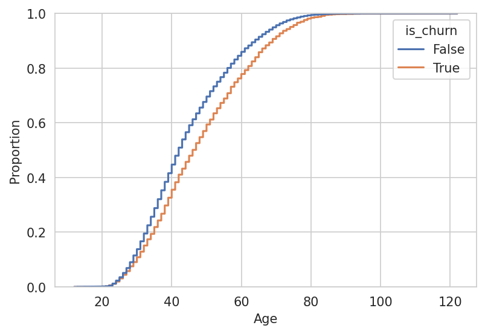
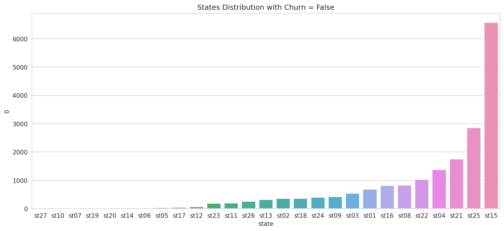
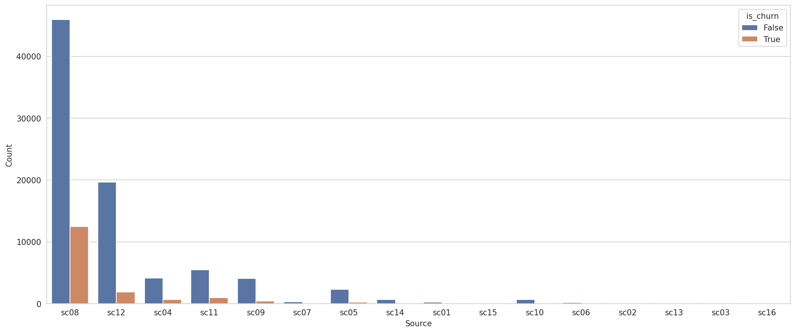

# Análise Exploratória de Dados


Antes de iniciar, vamos deixar claro **o que representa um churn aqui nesse desafio.**

>Churn é todo cliente que deixa de comprar na Magalu após um certo período de tempo.


Iremos iniciar nossa análise pelo dataset de treino, porém parte dessa análise foi aplicada no dataset de teste no intuito de ver se alguns padrões se repetiam, já que a base de teste foi fornecida pelo desafio.

>Lembrando que o código completo e os notebooks com todas as EDAs podem ser encontrados no [repositório](https://github.com/LucianoBatista/churn-classifier).

Como estamos falando de um problema de classificação, vale a pena iniciar a análise entendendo como os dados estão balanceados.

## Quanto nosso dado está desbalanceado?

```py
# is_churn proportion
df = client_tr["is_churn"].value_counts(normalize=True).reset_index()

_ = sns.countplot(x="is_churn", data=client_tr)
plt.show()
```


Aqui vemos que nossos dados está numa proporção de 82% sendo não ocorrência de churn, contra 18% que efetivamente deram churn. Esse desbalanceamento pode impactar na etapa de modelagem, sendo assim, uma abordagem interessante seria aplicação de alguma técnica de balanceamento.

## Como as idades estão distribuídas?

Achei mais útil converter a variável de data de nascimento (`birthdate`) em idade. Após fazer essa conversão, foi possível observar como a variável está se comportando em relação ao nosso target.

```py
# convertendo em idade
client_tr["age"] = datetime.date.today().year - client_tr["birthdate"].dt.year

# plotting
_ = sns.ecdfplot(x="age", data=client_tr, hue="is_churn")
plt.show()
```



Pelas distribuições, vemos que existe uma maior proporção de churn em pessoas com idades mais avançadas.

E essa é a distribuição sem distinção de churn:

```py
_ = sns.histplot(x="age", data=client_tr)
plt.show()
```


Podemos ver que existem algumas pessoas abaixo dos 15 anos, onde a maioria não representou churn (*verificação feita no notebook*), mas também temos algumas possoas acima dos 100 anos, esses extremos podem precisar de uma segunda investigação.

## Como o Gênero Sexual (`gender`) se comporta em relação ao target?

```py
_ = sns.countplot(x="gender", data=client_tr, hue="is_churn")

```


Aparentemente, pessoas de ambos os gêneros possuem uma distribuição semelhante a da própria feature target (`is_churn`).

## Onde está localizado a maior quantidade de clientes da Magalu?

Nós temos, em todos os datasets fornecidos no desafio, duas variáveis de Estado:

- `state`: local onde o cliente reside.
- `delivery_state`: local de destino da entrega do pedido.

```py
# plot configuration
fig_size = (14, 6)
fig, ax = plt.subplots(figsize=fig_size)

# data
df = client_tr[["state", "is_churn"]].value_counts().reset_index()

# alternando entre True e False para o churn
_ = sns.barplot(x="state", y=0, data=df[df["is_churn"] == True].sort_values([0]))
plt.title("States Distribution with Churn = True")
plt.show()

```




Nesse primeiro momento, estaremos olhando apenas para `state`. E, conseguimos ver que existe uma grande concentração de clientes no **Estado st15**, muito mais que nos Estados subsequentes. 

Veja também que a distribuição é praticamente idêntica considerando apenas casos de *churn* e *não churn*.

*E o estado onde mais entrega?*

- TODO!

## Podemos dizer algo sobre os métodos de pagamentos escolhidos pelos clientes?

No nosso dataset de `orders`, vemos que existem 14 métodos de pagamento diferentes, algums sendo mais utilizados que outros. Mas, observando a distribuição, vemos que existe uma preferência muito grande pelo método `pm5`, sendo consequentemente o maior responsável pela presença de churn. Outros métodos de pagamento possuem uma proporção muito baixa de churn.

```py
df = or_pr_cl_df[["payment_method", "is_churn"]].value_counts().reset_index()

fig, ax = plt.subplots(figsize=fig_dim)

_ = sns.barplot(x="payment_method", y=0, data=df, hue="is_churn")
plt.show()
```


## `source` e `device` possuem um comportamento parecido com os métodos de pagamento?

Essas duas outras variáveis categóricas também possuem comportamentos bem característicos, onde existe a preferência por uma determinada classe e variação na distribuição de churn, o que pode ser interessante para nosso modelo de classificação.

### Source

Aqui vemos que o `sc08` possui maior preferência de utilização, e também é responsável por maior concentração de churn, tendo uma proporção bem diferente das outras variáveis.

```py
_ = sns.countplot(x="source", data=or_pr_cl_df, hue="is_churn", ax=ax)
plt.xlabel("Source")
plt.ylabel("Count")
plt.show()
```



### Device

Nessa outra feature, o `dv9` é o mais utilizado e responsável por maior presença de churn. Particularmente o `dv3` tem uma contagem bem alta de não churn, proporcionalmente maior que qualquer outro device.

```py
_ = sns.countplot(x="device", data=or_pr_cl_df, hue="is_churn")
plt.xlabel("Device")
plt.ylabel("Count")
plt.show()
```


## Como se dão os pedidos em função dos feriados?

- **TODO:**

